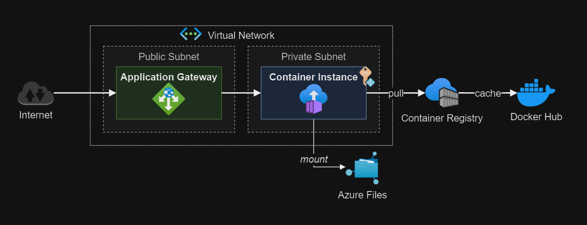

# Azure Container Registry - Security features

Deploy Azure Container Instances groups in a VNET.



Start by creating the `.auto.tfvars` from the template:

```sh
cp config/template.tfvars .auto.tfvars
```

Create the first batch of resources:

```sh
terraform init
terraform apply -auto-approve
```

The container image must exist in order to deploy the CI.

## Deployment

Once the resources are created, build and push the application image to the ACR:

```sh
cd app

az acr build --registry crchokolatte --image app:latest --file Dockerfile.amd64 .
```

Once the image is pushed, set the config to create the CI and the AGW:

```terraform
create_containers = true
```

Create the remaining resources:

```sh
terraform apply -auto-approve
```

Connect to the application using the Application Gateway public address.

## Deployment (YAML)

An option to [deploy containers with YAML][1] files is also available.

Example copied from the documentation in the [deploy-aci.yaml](./deploy-aci.yaml) file:

```sh
az group create --name myResourceGroup --location eastus
az container create --resource-group myResourceGroup --file deploy-aci.yaml
```

## Artifact Cache

Azure Container Registry supports [Artifact Cache][2]. Follow the steps in the documentation to create a caching rule.

Here's a NGINX rule via [CLI][3]:

> [!IMPORTANT]
> Use **authentication** for real world deployment.

```sh
az acr cache create -r crchokolatte -n nginx -s docker.io/library/nginx -t nginx
```

Login to ACR and run a test pull command:

```sh
az acr login -n crchokolatte
docker pull crchokolatte.azurecr.io/nginx:latest
```

Deploy a new instance using the cached NGINX:

> [!IMPORTANT]
> This procedure might require a [service identity][4].

```sh
az group create --name rg-artifact-cache --location eastus
az container create --resource-group rg-artifact-cache --file deploy-nginx-cached.yaml
```

[1]: https://learn.microsoft.com/en-us/azure/container-instances/container-instances-multi-container-yaml#deploy-the-container-group
[2]: https://learn.microsoft.com/en-us/azure/container-registry/tutorial-artifact-cache
[3]: https://learn.microsoft.com/en-us/azure/container-registry/tutorial-enable-artifact-cache-cli
[4]: https://learn.microsoft.com/en-us/answers/questions/1289158/container-image-unable-to-pull-private-azure-conta
